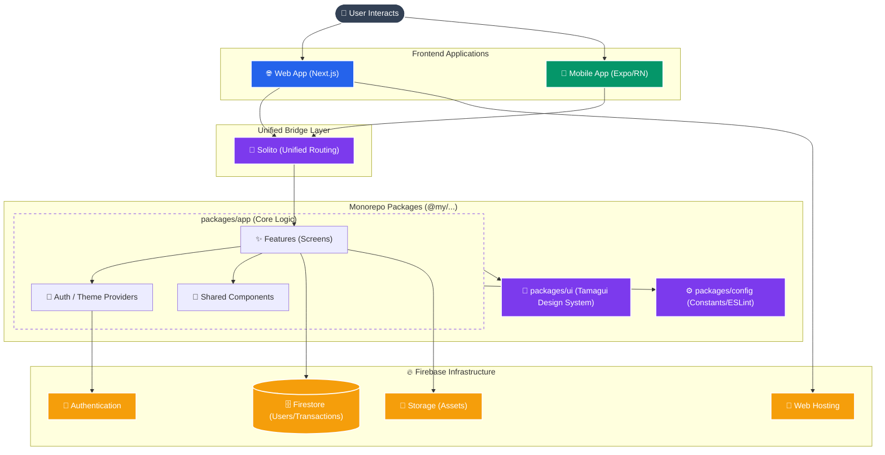
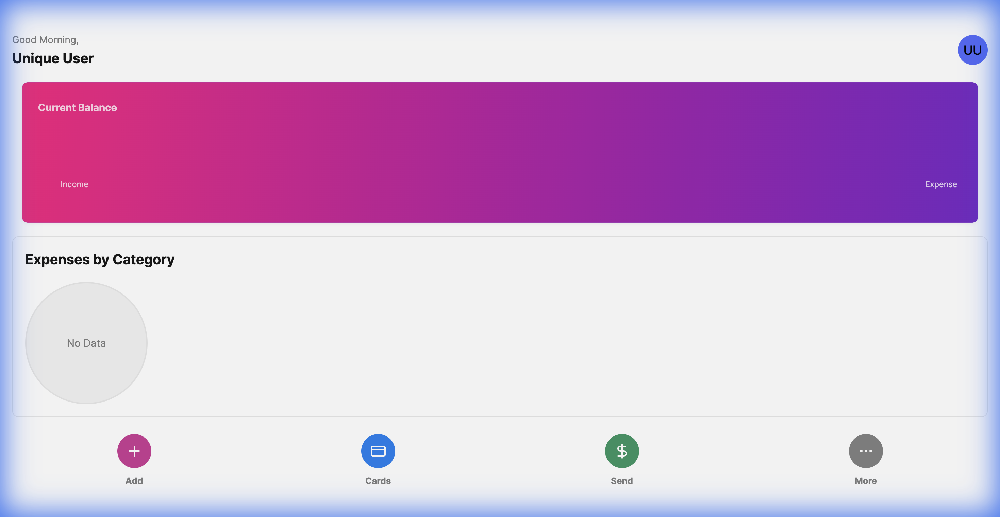
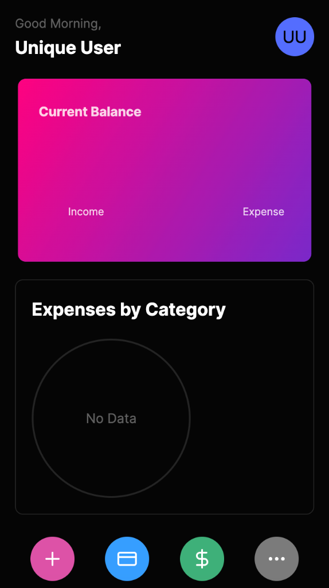

# AI Powered Expense Tracker Pro - Cross-Platform (Web & Mobile)

A production-ready expense tracker application built with a modern monorepo architecture, targeting both Web (Next.js) and Mobile (Expo/React Native) from a single codebase.

> **✨ AI-Driven Development**: This entire project, including the monorepo setup, UI/UX implementation, and backend integration, was architected and built using **advanced AI agents**, demonstrating the future of software development.

## 🚀 live Demo
**Web App:** [https://expense-tracker-pro-8531b.web.app](https://expense-tracker-pro-8531b.web.app)

## 🛠 Tech Stack
- **Monorepo**: [Turborepo](https://turbo.build/)
- **Core Framework**: [Solito](https://solito.dev/) (Unifies Next.js and Expo)
- **Web**: [Next.js](https://nextjs.org/) (App Router)
- **Mobile**: [Expo](https://expo.dev/) (React Native)
- **UI Component Library**: [Tamagui](https://tamagui.dev/) (Cross-platform styling)
- **Backend / DB / Auth**: [Firebase](https://firebase.google.com/) (Firestore, Authentication, Hosting)

## 🏗 System Architecture



## ✨ Features
- **AI-Architected**: Built entirely by advanced AI agents, showcasing the power of autonomous coding.
- **Authentication**: Secure Login & Signup via Firebase Auth.
- **Cross-Platform UI**: Consistent, high-contrast Dark/Light mode theme.
- **Dashboard**: Real-time overview of Balance, Income, and Expenses.
- **User Isolation**: Data is securely scoped to each authenticated user.
- **Transactions**: Add, filter, and view transaction history.
- **Visualizations**: Interactive charts for expense breakdown.
- **Responsive**: Optimised for Desktop, Tablet, and Mobile.

## 📸 Screenshots

| Desktop Web | Mobile Web |
|:---:|:---:|
|  |  |

## 📂 Project Structure
```
.
├── apps
│   ├── expo          # Native App (iOS/Android)
│   └── next          # Web App (Next.js)
├── packages
│   ├── app           # Shared application logic & screens (90% of code)
│   ├── config        # Shared configuration (Tamagui, ESLint)
│   └── ui            # Shared UI components (Input, Button, Layouts)
└── firebase.json     # Firebase Hosting Config
```

## ⚡️ Getting Started

### Prerequisites
- Node.js (v18+)
- Yarn
- Expo Go (on mobile device)

### 1. Installation
Clone the repository and install dependencies:
```bash
yarn install
```

### 2. Environment Setup
Create a `.env.local` file in `apps/next/` and `.env` in `apps/expo/` with your Firebase credentials:
```env
NEXT_PUBLIC_FIREBASE_API_KEY=your_api_key
NEXT_PUBLIC_FIREBASE_AUTH_DOMAIN=your_project.firebaseapp.com
NEXT_PUBLIC_FIREBASE_PROJECT_ID=your_project_id
NEXT_PUBLIC_FIREBASE_STORAGE_BUCKET=your_project.firebasestorage.app
NEXT_PUBLIC_FIREBASE_MESSAGING_SENDER_ID=your_sender_id
NEXT_PUBLIC_FIREBASE_APP_ID=your_app_id
NEXT_PUBLIC_FIREBASE_APP_ID=your_app_id
```

### 3. Demo Login
To quickly test the application without signing up, you can use these credentials:
- **Email:** `usera@test.com`
- **Password:** `password`

### 3. Running the App

**Start All (Web + Native):**
```bash
yarn web
# In a separate terminal
yarn native
```

**Web Only:**
```bash
yarn web
```
*Access at http://localhost:3000*

**Mobile (iOS/Android):**
```bash
yarn native
```
*Scan the QR code with the Expo Go app.*

## 🚀 Deployment

### Web (Firebase Hosting)
The web app is configured for **Static Export** (`output: 'export'`) to host on Firebase's free Spark plan.

1. **Build**:
   ```bash
   yarn web:prod
   ```
   This generates the static files in `apps/next/out`.

2. **Deploy**:
   ```bash
   npx firebase-tools deploy --only hosting
   ```

## 🔒 Security
- **Data Isolation**: Firestore rules ensure users can only read/write their own data (`resource.data.userId == request.auth.uid`).
- **Protected Routes**: Unauthenticated users are redirected to Login; Authenticated users are redirected to Dashboard.

## 📱 Mobile Notes
- Uses `KeyboardAvoidingView` to handle software keyboard overlaps.
- Uses `LinearGradient` fallback (purple background) for native cards if gradients fail to load.
